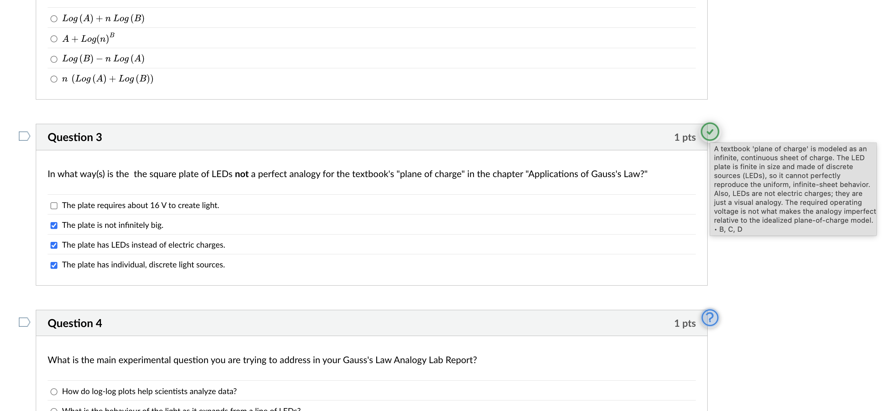
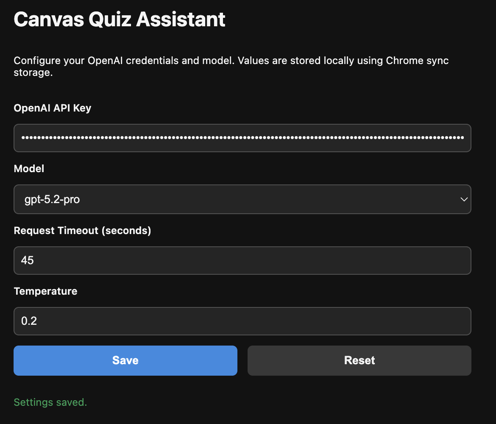

# Quiz GPT

Quiz GPT is a Chrome extension written in TypeScript that assists with online quizzes. It injects a helper button for each question, captures the question context (including a screenshot), sends it to OpenAI for analysis, and applies the suggested answer in the quiz UI.



## Supported Platforms

- **Canvas LMS** (Instructure) - Fully supported
- **WileyPLUS** (education.wiley.com) - Supported
- **ExpertTA** - Coming soon

The extension uses a modular platform adapter system, making it easy to add support for new quiz platforms.

## Runtime Behavior

- Detects supported quiz platforms by URL and DOM structure.
- Injects a floating button onto each question container.
- On click:
  - Captures the question DOM and a PNG screenshot with `html2canvas`.
  - Sends contextual text and the image to the background service.
  - The background worker calls OpenAI and expects strict JSON with selected choice IDs (and optional free-form text answers).
  - The content script applies the suggestion to the quiz UI, toggling the button state to success, error, or timeout.
  - NOTE: The selected answer could have been misapplied by the interpreter, it is always best that you hover over the checkmark and read what it outputs to ensure it is correct.

## Getting Started

```bash
npm install
npm run build
```

The build command bundles the TypeScript sources with `tsup` and copies static assets into `dist/`.

### Load the Extension in Chrome

1. Open `chrome://extensions/`.
2. Enable **Developer mode**.
3. Choose **Load unpacked** and select the `dist/` directory created by `npm run build`.

### Configure OpenAI Settings

Open the extension's options page (Chrome menu → Extensions → Quiz GPT → Details → Extension options) and provide:

- **OpenAI API Key** – required; stored using `chrome.storage.sync`.
- **Model** – defaults to `gpt-4o-mini`. Any compatible OpenAI Chat Completions model can be used.
- **Request Timeout** – limits how long the background worker waits for OpenAI in seconds.
- **Temperature** – controls response creativity (defaults to `0.2`).



## Adding a New Platform

To add support for a new quiz platform:

1. Create a new directory under `src/content/platforms/` (e.g., `src/content/platforms/wiley/`).
2. Implement the `PlatformAdapter` interface in `index.ts`:

```typescript
import type { PlatformAdapter, ParsedQuestion, QuestionCallback } from "../types.js";

export class WileyPlatformAdapter implements PlatformAdapter {
  readonly id = "wiley";
  readonly name = "Wiley Plus";

  isQuizPage(): boolean {
    // Return true if current page is a Wiley quiz
  }

  observeQuestions(callback: QuestionCallback): () => void {
    // Find question elements and call callback for each
  }

  parseQuestion(element: HTMLElement, fallbackIndex: number): ParsedQuestion {
    // Parse the question element into the standard format
  }

  getQuizTitle(): string | undefined {
    // Extract quiz title from the page
  }
}
```

3. Register the adapter in `src/content/platforms/index.ts`:

```typescript
import { WileyPlatformAdapter } from "./wiley/index.js";

platformRegistry.register(
  new WileyPlatformAdapter(),
  [/wileyplus\.com/i],
  ["https://*.wileyplus.com/*"]
);
```

4. Add the host patterns to `static/manifest.json`:
   - Add to `host_permissions`
   - Add to `content_scripts[0].matches`
   - Add to `web_accessible_resources[0].matches`

## Project Structure

```
src/
├── background/           # Background service worker (OpenAI API calls)
├── content/              # Content script (UI injection)
│   ├── platforms/        # Platform adapters
│   │   ├── canvas/       # Canvas LMS adapter
│   │   ├── types.ts      # Shared types for platform adapters
│   │   ├── registry.ts   # Platform detection registry
│   │   └── index.ts      # Platform registration
│   ├── applyAnswer.ts    # Answer application logic
│   ├── capture.ts        # Screenshot capture
│   ├── questionAssistant.ts  # UI button component
│   └── index.ts          # Main content script
├── options/              # Extension options page
└── shared/               # Shared types and settings
```

## TODO's

- [ ] Add auto testing and some way to fake quizzes.
- [x] Add WileyPLUS support.
- [ ] Add ExpertTA support.
- [ ] ...
